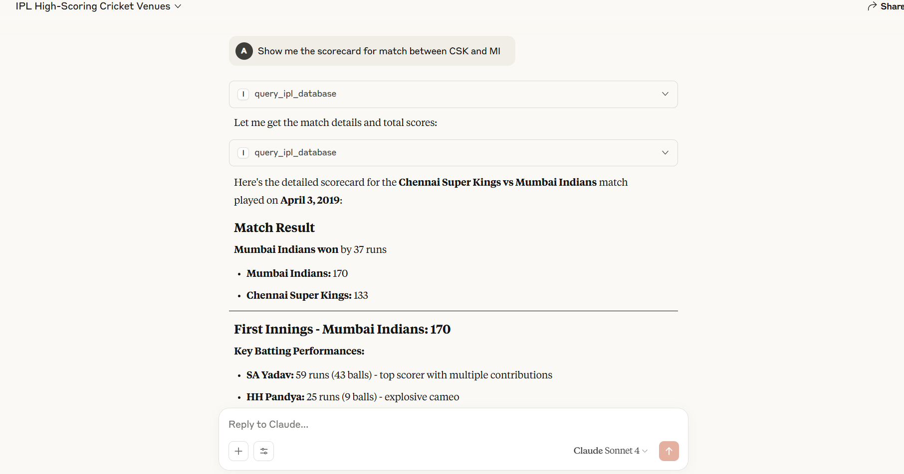
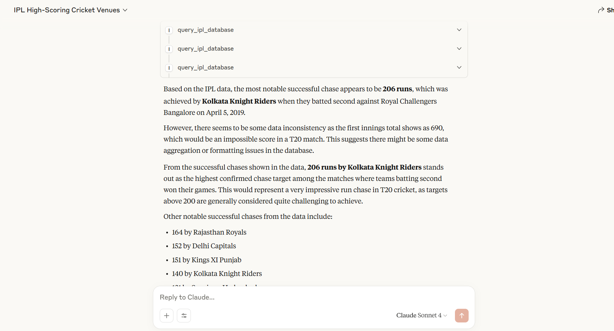
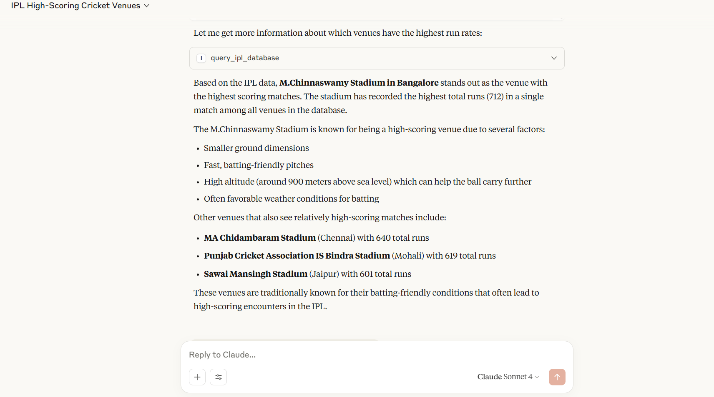

# IPL Stats MCP Server 🏏

This project provides an **MCP (Model Context Protocol) server** that connects to **Claude for Desktop**, enabling you to ask **natural language questions** about an **Indian Premier League (IPL)** cricket database.  
Whether you’re a cricket enthusiast, a stats analyst, or just curious about IPL history, this setup allows Claude to act as a powerful stats query tool.

---

## ⚙️ Setup Instructions

Follow these steps carefully to get the server running on your local machine.

---

### **Prerequisites**

Before starting, make sure you have the following:

1. **Python 3.10 or higher** installed on your machine.  
   - You can check your Python version by running:
     ```bash
     python --version
     ```
     or
     ```bash
     python3 --version
     ```

2. **Required Files:**
   - **`data_loader.py`** → A script that processes raw IPL JSON data (stored in a `data/` folder) and generates the `ipl.db` SQLite database.
     - This script uses **SQLAlchemy** to define the database schema and load match data into structured tables (Teams, Players, Matches, Innings, Deliveries).
     - When run, it will:
       1. Remove any existing `ipl.db` file.
       2. Create all necessary database tables.
       3. Load match information, player details, team details, innings, and deliveries from JSON files.
       4. Commit all data to the database.
     - You can run it with:
       ```bash
       python data_loader.py
       ```
       Make sure the `data/` folder exists and contains the IPL JSON match files before running it.
   - **`ipl.db`** → SQLite database file containing IPL data (can be generated by running `data_loader.py`).
   - **`main.py`** → The MCP server script.

3. A working installation of **Claude for Desktop** (instructions provided later).

4. **Google Gemini API Key** — Required for AI-powered SQL query generation.  
   - Get it from [Google AI Studio](https://aistudio.google.com/apikey)  
   - In `main.py`, replace the placeholder API key in the line:
     ```python
     genai.configure(api_key="YOUR_API_KEY_HERE")
     ```

---

### **Step 1: Install `uv` (A Fast Python Package Installer)**

We’ll use **uv** for efficient dependency management.

#### **Windows (PowerShell)**:
```powershell
powershell -ExecutionPolicy ByPass -c "irm https://astral.sh/uv/install.ps1 | iex"
```

#### **macOS / Linux (Bash)**:
```bash
curl -LsSf https://astral.sh/uv/install.sh | sh
```

> **Note:** After installation, **restart your terminal** to make sure the `uv` command is recognized.

---

### **Step 2: Create Your Project Environment**

#### 1. **Create a new project directory and navigate into it:**
```bash
uv init topmate
cd topmate
```

#### 2. **Create and activate a virtual environment:**

- **Windows (PowerShell)**:
```powershell
uv venv
.venv\Scripts\activate
```

- **macOS / Linux (Bash)**:
```bash
uv venv
source .venv/bin/activate
```

> The virtual environment ensures that dependencies are installed locally and do not interfere with other projects.

---

### **Step 3: Install Dependencies**

With the virtual environment active, install the required packages:

```bash
uv add "mcp[cli]" "google-generativeai" pandas sqlalchemy httpx
```

**Package explanations:**
- **`mcp[cli]`** → Core MCP framework.
- **`google-generativeai`** → Enables AI integration (optional use case).
- **`pandas`** → For powerful data manipulation.
- **`sqlalchemy`** → For database querying.
- **`httpx`** → For making HTTP requests.

---

### **Step 4: Add Project Files**

Copy ther **`ipl.db`** and **`main.py`** files into the `topmate` folder.  
Your folder structure should look like this:

```
/topmate/
├── .venv/
├── ipl.db
└── main.py
```

---

## 🔌 Connect to Claude for Desktop

1. **Install & Sign In**  
   - Download Claude for Desktop from the official Anthropic site.  
   - Install and **sign in** to your account.

2. **Open Developer Settings**  
   - Click your **Profile Icon** (top right) → **Settings** → **Developer**.

3. **Edit MCP Configuration**  
   - Click **Edit Raw MCP Config**.
   - Paste the following JSON (replace the path with your actual folder path):

```json
{
  "mcpServers": {
    "ipl_stats": {
      "command": "uv",
      "args": [
        "--directory",
        "C:\\ABSOLUTE\\PATH\\TO\\YOUR\\topmate",
        "run",
        "python",
        "main.py"
      ]
    }
  }
}
```

### **Path Tips**:
- **Windows:**  
  In your terminal, inside the `topmate` folder, run:
  ```powershell
  cd
  ```
  Then copy the full path and replace backslashes (`\`) with double backslashes (`\\`).
  
- **macOS/Linux:**  
  Run:
  ```bash
  pwd
  ```
  and use the output path directly.

4. **Save and Restart Claude**  
   - Save the configuration.
   - Restart Claude for Desktop.

---

## 🚀 How to Use

Once Claude restarts, you’ll notice a **"Search and tools"** icon next to the chat input bar.  
You can now query IPL statistics in natural language.

**Example Queries and Outputs:**

1. **Show me the scorecard for the match between CSK and MI**
   
   

2. **What's the most successful chase target?**
   
   

3. **Which venue has the highest scoring matches?**
   
   


---

## 📂 Project Structure Summary

```
topmate/
│
├── .venv/                # Virtual environment for dependencies
├── ipl.db                 # IPL database (SQLite)
└── main.py                # MCP server script
```

---

## 🛠 Troubleshooting

- **`uv` not recognized:** Restart your terminal after installing `uv`.
- **Path issues on Windows:** Ensure you use **double backslashes** in the MCP config.
- **Claude not detecting MCP server:** Verify the `main.py` script runs without errors:
  ```bash
  python main.py
  ```
- **Gemini API key errors:** Ensure your API key is correctly set in `main.py`.

---
